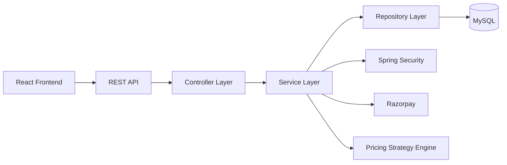
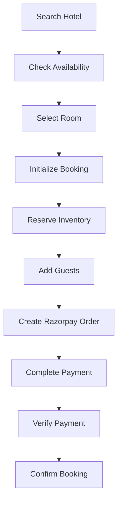
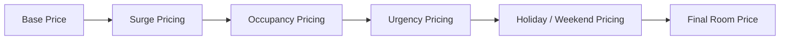
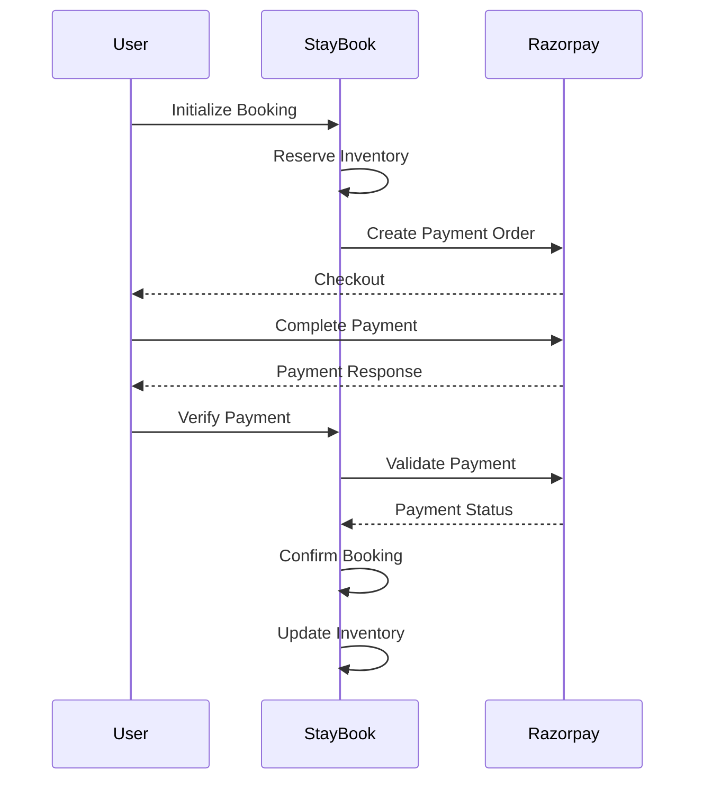
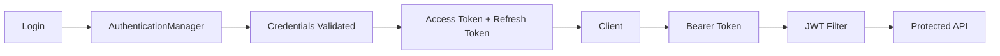
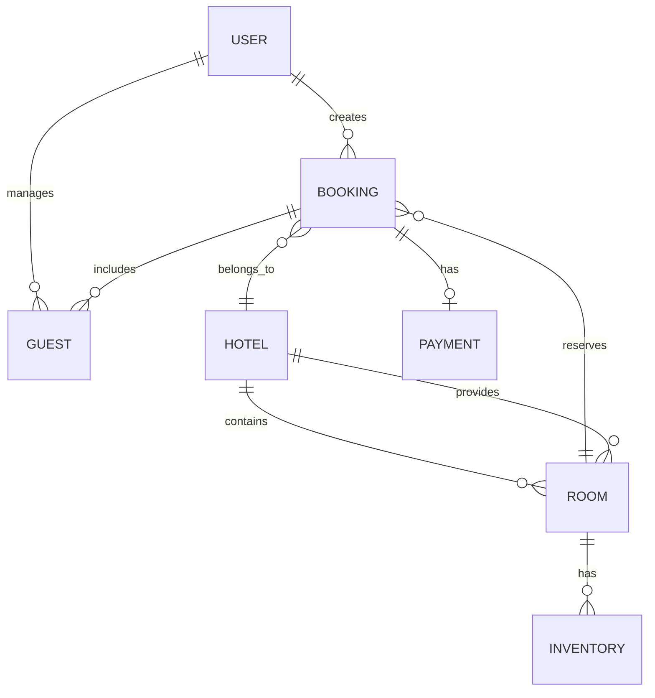

<div align="center">

# 🏨 StayBook

### Full-Stack Hotel Booking Platform

A full-stack hotel booking platform built with **Java, Spring Boot, React, MySQL & Razorpay**, featuring secure authentication, transactional booking workflows, concurrency-safe inventory management, dynamic pricing, and online payments.

<br/>

**Java** · **Spring Boot** · **Spring Security** · **React** · **MySQL** · **Hibernate** · **Razorpay**

<br/>

[Features](#-features) · [Architecture](#-architecture) · [Booking Flow](#-booking-flow) · [Getting Started](#-getting-started) · [API](#-api-overview)

</div>

---

## ✨ Overview

**StayBook** is a full-stack hotel reservation system designed around real-world booking and payment workflows rather than simple CRUD operations.

The application allows users to:

* Search hotels and check room availability
* View hotel and room information
* Create and manage bookings
* Add guests to reservations
* Make payments through Razorpay
* Track booking and payment status
* Cancel bookings and process refunds
* Download payment receipts

Hotel managers can manage their properties, rooms, inventory, pricing, bookings, and revenue reports through a dedicated dashboard.

The backend is built as a **layered Spring Boot application** with REST APIs, Spring Security, JWT authentication, JPA/Hibernate, transactional service methods, and MySQL persistence.

---

# 🚀 Features

<table>
<tr>
<td width="50%">

### 🔐 Authentication & Security

* JWT-based authentication
* Refresh-token support
* BCrypt password hashing
* Role-based authorization
* Protected REST APIs
* Stateless Spring Security

</td>
<td width="50%">

### 🏨 Hotel Management

* Hotel creation & management
* Room type management
* Hotel activation
* Room inventory management
* Manager dashboard
* Revenue reporting

</td>
</tr>

<tr>
<td>

### 📅 Booking System

* Hotel search
* Date-based availability
* Room selection
* Guest management
* Booking state management
* Booking cancellation
* Booking history

</td>
<td>

### 💳 Payments

* Razorpay integration
* Order creation
* Server-side verification
* Payment status tracking
* Webhooks
* Failed payments
* Refunds
* Payment receipts

</td>
</tr>

<tr>
<td>

### 📦 Inventory & Concurrency

* Date-wise inventory
* Reserved inventory
* Booked inventory
* Transactional updates
* Pessimistic locking
* Concurrent booking protection

</td>
<td>

### 💰 Dynamic Pricing

* Base pricing
* Surge pricing
* Occupancy pricing
* Booking urgency pricing
* Holiday pricing
* Weekend pricing
* Strategy Pattern

</td>
</tr>
</table>

---

# 🧠 What Makes StayBook Different?

The project goes beyond a basic hotel CRUD application.

### Concurrency-aware booking

The inventory system uses **pessimistic database locking** during critical booking operations to reduce race conditions and prevent concurrent overbooking.

### Transactional booking workflow

Booking, inventory, payment, and confirmation operations are handled through transactional service logic to maintain consistency across related database operations.

### Composable pricing engine

Pricing rules are implemented using the **Strategy Pattern**, allowing multiple pricing factors to be composed instead of putting every condition into one large method.

### Real payment lifecycle

The payment system handles more than just a successful checkout:

```text
Order Creation
      ↓
Payment
      ↓
Signature Verification
      ↓
Server-side Validation
      ↓
Booking Confirmation
```

It also handles:

```text
Failed Payment
Refund
Webhook Events
Payment State Updates
```

---

# 🏗️ Architecture



### Backend Structure

```text
Controller
    ↓
Service
    ↓
Repository
    ↓
JPA / Hibernate
    ↓
MySQL
```

Supporting components:

```text
DTOs
Security
JWT
Exception Handling
Pricing Strategies
Configuration
Utilities
```

---

# 📅 Booking Flow

StayBook uses a multi-step booking workflow.



### Booking States

```text
RESERVED
    ↓
GUESTS_ADDED
    ↓
PAYMENTS_PENDING
    ↓
CONFIRMED
```

Alternative states:

```text
CANCELLED
EXPIRED
```

---

# 🔒 Inventory & Concurrency

Inventory is maintained using separate counters:

```text
Total Inventory
      │
      ├── Reserved Rooms
      │
      └── Booked Rooms
```

### During reservation

```text
reservedCount += requestedRooms
```

### After successful payment

```text
reservedCount -= requestedRooms
bookedCount   += requestedRooms
```

### Cancellation before confirmation

```text
reservedCount -= requestedRooms
```

### Cancellation after confirmation

```text
bookedCount -= requestedRooms
```

Critical inventory operations use **transactional service methods and pessimistic locking** to protect against concurrent booking conflicts.

---

# 💰 Dynamic Pricing Engine

StayBook uses a composable pricing strategy:



### Pricing Factors

| Strategy          | Description                          |
| ----------------- | ------------------------------------ |
| Base Pricing      | Room's configured base price         |
| Surge Pricing     | Applies configurable surge factors   |
| Occupancy Pricing | Adjusts price based on occupancy     |
| Urgency Pricing   | Adjusts price for near-term bookings |
| Holiday Pricing   | Handles configured holidays          |
| Weekend Pricing   | Applies weekend pricing rules        |

The pricing implementation uses the **Strategy Pattern** so individual pricing rules remain independently composable.

---

# 💳 Payment System

StayBook integrates **Razorpay** for online payments.

### Payment Lifecycle



### Payment Features

* Razorpay order creation
* Payment signature verification
* Server-side payment validation
* Payment state tracking
* Failed-payment handling
* Razorpay webhooks
* Refund processing
* Refund webhook handling
* Booking confirmation
* Downloadable payment receipts

### Payment States

```text
PENDING
CONFIRMED
FAILED
CANCELLED
REFUNDED
```

### Webhook Endpoint

```text
POST /api/v1/webhooks/razorpay
```

Handled events include:

```text
payment.captured
payment.authorized
payment.failed
refund.processed
```

---

# 🔐 Authentication & Authorization

Authentication is implemented using **Spring Security + JWT**.



### Security Components

* JWT access tokens
* Refresh tokens
* BCrypt password hashing
* Spring Security filters
* Role-based authorization
* Protected REST endpoints

### Roles

```text
GUEST
HOTEL_MANAGER
```

---

# 📊 Manager Dashboard

Hotel managers have access to management functionality for their properties.

### Hotel Operations

* Create hotels
* Update hotel details
* Delete hotels
* Activate hotels
* View managed hotels

### Room Operations

* Create rooms
* View rooms
* Delete rooms
* Configure room pricing
* Manage inventory

### Business Operations

* View bookings
* Manage pricing
* Generate revenue reports
* Monitor booking activity

---

# 📈 Revenue Reporting

The application provides hotel-level revenue reporting over a selected date range.

Reports include:

* Confirmed bookings
* Confirmed booking revenue
* Average revenue per confirmed booking

---

# 🗄️ Domain Model



### Core Entities

```text
User
Hotel
Room
Inventory
Booking
Guest
Payment
HotelMinPrice
```

---

# 🧩 Design & Engineering Concepts

StayBook demonstrates:

| Concept                | Implementation                    |
| ---------------------- | --------------------------------- |
| Layered Architecture   | Controller → Service → Repository |
| DTO Pattern            | API/service data transfer         |
| Strategy Pattern       | Dynamic pricing                   |
| Dependency Injection   | Spring IoC                        |
| Repository Pattern     | Spring Data JPA                   |
| Transaction Management | `@Transactional`                  |
| Pessimistic Locking    | Concurrent inventory protection   |
| JWT Authentication     | Stateless authentication          |
| RBAC                   | Guest / Hotel Manager             |
| Centralized Exceptions | Global exception handling         |
| ORM                    | Hibernate / JPA                   |

---

# 📁 Project Structure

```text
StayBook/
│
├── src/
│   ├── main/
│   │   ├── java/
│   │   │   └── com/logic/
│   │   │       ├── DTO/
│   │   │       ├── Repository/
│   │   │       ├── Service/
│   │   │       ├── advice/
│   │   │       ├── config/
│   │   │       ├── controller/
│   │   │       ├── entity/
│   │   │       ├── exception/
│   │   │       ├── security/
│   │   │       ├── strategy/
│   │   │       └── utils/
│   │   │
│   │   └── resources/
│   │       └── application.properties
│   │
│   └── test/
│
├── airhouse-frontend/
│   ├── src/
│   │   ├── assets/
│   │   ├── components/
│   │   ├── context/
│   │   ├── views/
│   │   ├── api.js
│   │   ├── App.jsx
│   │   └── main.jsx
│   │
│   ├── package.json
│   └── vite.config.js
│
├── pom.xml
└── README.md
```

---

# 🛠️ Tech Stack

### Backend

`Java 17` · `Spring Boot` · `Spring MVC` · `Spring Security` · `Spring Data JPA` · `Hibernate` · `JJWT` · `ModelMapper` · `Maven`

### Frontend

`React 19` · `JavaScript` · `Vite` · `HTML` · `CSS` · `Fetch API`

### Database

`MySQL`

### Payment

`Razorpay`

### API & Development

`REST APIs` · `Swagger / OpenAPI` · `Git` · `GitHub` · `Postman` · `IntelliJ IDEA` · `VS Code`

---

# ⚡ Getting Started

## Prerequisites

Install:

* Java 17+
* Maven
* Node.js & npm
* MySQL
* Razorpay test credentials

---

## 1. Clone

```bash
git clone <YOUR_REPOSITORY_URL>
cd StayBook
```

---

## 2. Create Database

```sql
CREATE DATABASE airbnb_pr;
```

---

## 3. Configure Backend

Create your local configuration with the required database, JWT, and Razorpay credentials.

Example:

```properties
spring.application.name=StayBook

spring.datasource.url=jdbc:mysql://localhost:3306/airbnb_pr
spring.datasource.username=YOUR_DB_USERNAME
spring.datasource.password=YOUR_DB_PASSWORD

spring.jpa.database-platform=org.hibernate.dialect.MySQLDialect
spring.jpa.hibernate.ddl-auto=update

server.port=8089
server.servlet.context-path=/api/v1

jwt.secretKey=YOUR_JWT_SECRET

razorpay.key.id=YOUR_RAZORPAY_KEY_ID
razorpay.key.secret=YOUR_RAZORPAY_KEY_SECRET
razorpay.currency=INR
razorpay.business.name=StayBook
razorpay.webhook.secret=YOUR_WEBHOOK_SECRET
```

> ⚠️ **Never commit real credentials or secrets to GitHub.**

---

## 4. Run Backend

### Linux / macOS

```bash
./mvnw spring-boot:run
```

### Windows

```bash
mvnw.cmd spring-boot:run
```

Backend:

```text
http://localhost:8089
```

API base:

```text
http://localhost:8089/api/v1
```

---

## 5. Run Frontend

```bash
cd airhouse-frontend
npm install
npm run dev
```

Open the Vite development URL displayed in your terminal.

---

# 📚 API Overview

All APIs use:

```text
/api/v1
```

### Authentication

```text
POST /auth/signup
POST /auth/login
POST /auth/refresh
```

### Hotels

```text
POST /hotels/search
GET  /hotels/{hotelId}/info
```

### Bookings

```text
POST /bookings/init
POST /bookings/{bookingId}/guest
POST /bookings/{bookingId}/payments
POST /bookings/{bookingId}/payments/verify
POST /bookings/{bookingId}/payments/failed
POST /bookings/{bookingId}/cancel
GET  /bookings/{bookingId}/status
GET  /bookings/{bookingId}/invoice
```

### User

```text
GET    /users/profile
PATCH  /users/profile
GET    /users/myBookings
GET    /users/me/payments
GET    /users/me/guests
POST   /users/guests
PUT    /users/guests/{guestId}
DELETE /users/guests/{guestId}
```

### Manager

```text
POST   /admin/hotels
GET    /admin/hotels
GET    /admin/hotels/{hotelId}
PUT    /admin/hotels/{hotelId}
DELETE /admin/hotels/{hotelId}
PATCH  /admin/hotels/{hotelId}
GET    /admin/hotels/{hotelId}/bookings
GET    /admin/hotels/{hotelId}/reports
```

---

# 🧪 Testing

Run the test suite with:

```bash
./mvnw test
```

Windows:

```bash
mvnw.cmd test
```

The current project contains a Spring Boot application context test. Expanding automated coverage for booking concurrency, payment verification, authorization, refunds, and pricing would be a natural next improvement.

---

# 📸 Screenshots

> Add actual application screenshots here once you have them.

Recommended showcase:

```text
Home / Hotel Search
        ↓
Hotel Details
        ↓
Room Selection
        ↓
Checkout
        ↓
Razorpay Payment
        ↓
Booking Confirmation
        ↓
Manager Dashboard
```

A strong GitHub README should eventually include **4–6 clean screenshots**, preferably showing the complete user journey rather than random UI screens.

---

# 🔒 Security Notes

StayBook is a portfolio/learning project and should undergo additional hardening before production deployment.

Before deploying publicly:

* Store secrets in environment variables
* Never commit database passwords
* Never commit JWT secrets
* Never commit Razorpay secrets
* Configure HTTPS
* Restrict CORS to trusted origins
* Review resource-level authorization
* Add comprehensive integration tests
* Disable development/mock payment behavior in production
* Configure secure production cookie settings

---

# 🔮 Future Improvements

Potential next steps:

* [ ] Comprehensive unit & integration testing
* [ ] Automated booking-expiry cleanup
* [ ] Stronger resource-level authorization
* [ ] Email booking notifications
* [ ] OAuth / Google login
* [ ] Reviews & ratings
* [ ] Wishlist
* [ ] Redis caching
* [ ] Docker containerization
* [ ] CI/CD pipeline
* [ ] AWS deployment
* [ ] Advanced hotel search
* [ ] Elasticsearch integration where justified

---

# 👨‍💻 Author

<div align="center">

### Sujal Saini

**B.Tech Computer Science & Engineering**

Java Backend Developer · Spring Boot · REST APIs · Spring Security · Spring AI

</div>

---

<div align="center">

### ⭐ StayBook

**Built to explore real-world backend engineering challenges in hotel booking, inventory, pricing, authentication, and payments.**

</div>
