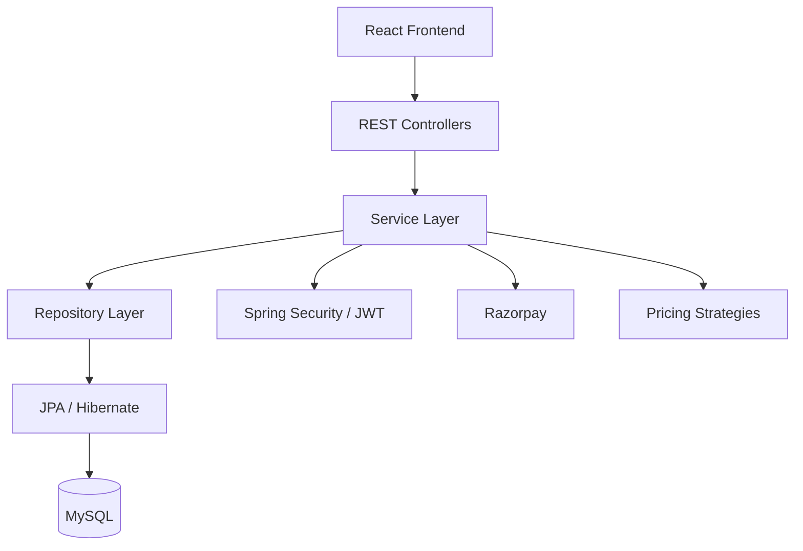
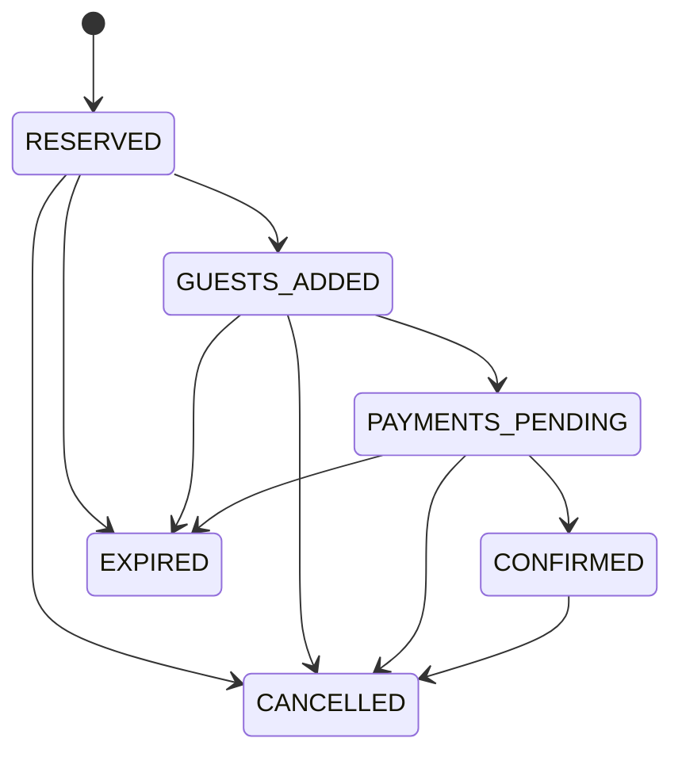
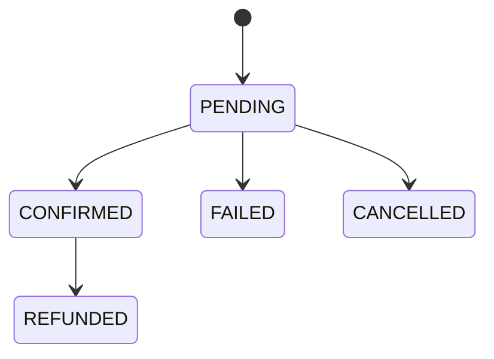

# 🏨 StayBook — Full-Stack Hotel Booking Platform

> A full-stack hotel booking platform built with **Java, Spring Boot, Spring Security, React, MySQL, and Razorpay**, featuring secure authentication, availability-aware inventory management, dynamic pricing, transactional booking workflows, and online payment processing.

---

## 📌 Overview

**StayBook** is a full-stack hotel booking application designed to simulate a real-world accommodation booking workflow.

Users can search for available hotels, view room information, manage guests, reserve rooms, complete payments through Razorpay, track bookings, and download payment receipts.

Hotel managers can manage hotels, rooms, inventory, pricing, bookings, and revenue reports through a dedicated management interface.

The backend is implemented as a **layered Spring Boot application** with RESTful APIs, Spring Security, JWT authentication, Spring Data JPA, Hibernate, and MySQL.

The project also focuses on backend concerns that go beyond basic CRUD, including:

* Transactional booking workflows
* Pessimistic locking for inventory
* Concurrent overbooking prevention
* Dynamic room pricing
* Payment verification
* Razorpay webhooks
* Payment failure handling
* Refund processing
* Booking state management
* Role-based authorization
* Centralized exception handling

---

## ✨ Key Features

### 👤 User Features

* User registration and login
* JWT-based authentication
* Refresh-token support
* BCrypt password hashing
* Role-based authorization
* Profile management
* Hotel search and availability checking
* Room and hotel details
* Guest management
* Booking management
* Booking history
* Payment history
* Booking status tracking
* Booking cancellation
* Downloadable payment receipts

---

### 🏨 Hotel & Room Management

Hotel managers can:

* Create hotels
* Update hotel details
* Delete hotels
* Activate hotels
* View managed hotels
* Create room types
* View rooms
* Delete rooms
* Configure room capacity and base pricing
* Manage room inventory
* Close/open inventory for selected dates
* Update surge pricing factors
* View hotel bookings
* Generate revenue reports

When a hotel is activated or a room is added to an active hotel, inventory records are initialized for a **one-year date range**.

---

### 📅 Hotel Search & Availability

Users can search hotels using:

* City
* Check-in date
* Check-out date
* Number of rooms
* Pagination

The availability system considers:

```text
Total Inventory
      ↓
- Booked Rooms
      ↓
- Reserved Rooms
      ↓
Available Rooms
```

Only inventory that is available across the requested date range is considered during the search and booking process.

---

## 🛏️ Booking Workflow

StayBook implements a multi-step booking workflow rather than directly creating a confirmed booking.

```text
Search Hotel
     ↓
Select Room
     ↓
Check Availability
     ↓
Initialize Booking
     ↓
Reserve Inventory
     ↓
Add Guests
     ↓
Create Payment Order
     ↓
Payment
     ↓
Verify Payment
     ↓
Confirm Booking
```

### Booking States

The backend maintains explicit booking states:

```text
RESERVED
     ↓
GUESTS_ADDED
     ↓
PAYMENTS_PENDING
     ↓
CONFIRMED
```

Bookings can also transition to:

```text
CANCELLED
EXPIRED
```

A booking hold is considered expired after **10 minutes** from creation when the relevant booking operation checks its validity.

---

## 🔒 Inventory & Concurrency Control

One of the core backend challenges in a hotel booking system is preventing two users from booking the same remaining inventory simultaneously.

StayBook uses **pessimistic database locking** when reading inventory during critical booking operations.

```text
User A ───────┐
              │
              ▼
        Lock Inventory
              │
        Check Availability
              │
        Reserve Rooms
              │
        Commit Transaction
              │
              ▼
        Release Lock

User B ─────────────────────► Re-checks availability
```

Inventory maintains separate counters for:

* `totalCount`
* `reservedCount`
* `bookedCount`

### Reservation

When a booking is initialized:

```text
reservedCount += requestedRooms
```

### Successful Payment

After payment confirmation:

```text
reservedCount -= requestedRooms
bookedCount   += requestedRooms
```

### Cancellation Before Confirmation

Reserved inventory is released:

```text
reservedCount -= requestedRooms
```

### Cancellation After Confirmation

Booked inventory is released:

```text
bookedCount -= requestedRooms
```

These operations are performed inside transactional service methods with inventory locking to maintain consistency.

---

## 💰 Dynamic Pricing

StayBook uses a composable **Strategy Pattern** for dynamic room pricing.

The pricing pipeline is built from multiple strategies:

```text
Base Price
    ↓
Surge Pricing
    ↓
Occupancy Pricing
    ↓
Urgency Pricing
    ↓
Holiday / Weekend Pricing
    ↓
Final Dynamic Price
```

### Pricing Factors

| Factor            | Logic                                                   |
| ----------------- | ------------------------------------------------------- |
| Base Price        | Room's configured base price                            |
| Surge             | Configurable inventory surge factor                     |
| Occupancy         | Additional pricing when occupancy exceeds 80%           |
| Booking Urgency   | Additional pricing for dates within the next 7 days     |
| Holiday / Weekend | Additional pricing for configured holidays and weekends |

Pricing is recalculated whenever relevant inventory values change.

The application also contains a scheduled pricing update process that periodically recalculates inventory prices and hotel minimum-price records.

---

## 💳 Razorpay Payment Integration

StayBook integrates the **Razorpay Payment Gateway** for online booking payments.

### Payment Flow

```text
Booking Created
      ↓
Razorpay Order Created
      ↓
Payment Checkout
      ↓
Payment Completed
      ↓
Server-Side Signature Verification
      ↓
Razorpay Payment Validation
      ↓
Payment Confirmed
      ↓
Booking Confirmed
      ↓
Inventory Updated
```

### Payment Features

* Razorpay order creation
* Payment checkout
* Server-side payment signature verification
* Payment amount validation
* Payment/order relationship validation
* Payment status tracking
* Failed-payment recording
* Razorpay webhook processing
* Refund processing
* Refund webhook handling
* Booking confirmation
* Downloadable payment receipts

### Supported Payment States

```text
PENDING
CONFIRMED
FAILED
CANCELLED
REFUNDED
```

### Razorpay Webhooks

The backend provides:

```text
POST /api/v1/webhooks/razorpay
```

and handles events including:

* `payment.captured`
* `payment.authorized`
* `payment.failed`
* `refund.processed`

Webhook signatures are validated before processing events.

---

## 🔐 Authentication & Authorization

The backend uses **Spring Security with JWT**.

### Authentication Flow

```text
Login
  ↓
Spring Security AuthenticationManager
  ↓
Credentials Validated
  ↓
Access Token + Refresh Token
  ↓
Client
  ↓
Bearer Token
  ↓
JWT Authentication Filter
  ↓
Protected REST API
```

### Roles

```text
GUEST
HOTEL_MANAGER
```

Manager-specific endpoints are protected using Spring Security role checks.

Password authentication uses **BCrypt** hashing.

The application uses stateless Spring Security sessions.

---

## 🧱 Backend Architecture

StayBook follows a layered architecture:



### Main Backend Layers

```text
controller/
    ↓
Service/
    ↓
Repository/
    ↓
entity/
```

Supporting packages include:

```text
DTO/
config/
security/
exception/
advice/
strategy/
utils/
```

### Design Patterns & Concepts

* Layered Architecture
* DTO Pattern
* Strategy Pattern
* Dependency Injection
* Repository Pattern
* Transaction Management
* Pessimistic Locking
* JWT Authentication
* Role-Based Access Control
* Centralized Exception Handling

---

## 🗂️ Project Structure

```text
Staybook-main/
│
├── src/
│   ├── main/
│   │   ├── java/com/logic/
│   │   │
│   │   ├── DTO/
│   │   ├── Repository/
│   │   ├── Service/
│   │   ├── advice/
│   │   ├── config/
│   │   ├── controller/
│   │   ├── entity/
│   │   │   └── enums/
│   │   ├── exception/
│   │   ├── security/
│   │   ├── strategy/
│   │   └── utils/
│   │
│   └── resources/
│       ├── application.properties
│       └── static/
│
├── src/test/
│
├── airhouse-frontend/
│   ├── src/
│   │   ├── assets/
│   │   ├── components/
│   │   ├── context/
│   │   ├── views/
│   │   ├── api.js
│   │   ├── App.jsx
│   │   └── main.jsx
│   │
│   ├── package.json
│   └── vite.config.js
│
├── pom.xml
├── mvnw
├── mvnw.cmd
└── README.md
```

---

## 🛠️ Tech Stack

### Backend

* Java 17
* Spring Boot 4.0.5
* Spring MVC
* Spring Security
* Spring Data JPA
* Hibernate
* JJWT
* ModelMapper
* Maven

### Frontend

* React 19
* JavaScript
* Vite
* HTML
* CSS
* Fetch API
* Lucide React
* Canvas Confetti

### Database

* MySQL

### Payment

* Razorpay

### API Documentation

* Springdoc OpenAPI / Swagger UI

### Development Tools

* IntelliJ IDEA
* VS Code
* Postman
* Git
* GitHub

---

# 🚀 Getting Started

## Prerequisites

Make sure the following are installed:

* Java 17+
* Maven
* Node.js and npm
* MySQL
* Razorpay test account/credentials

---

## 1. Clone the Repository

Clone the repository and enter the project directory.

```bash
git clone <YOUR_REPOSITORY_URL>
cd Staybook-main
```

---

## 2. Create the MySQL Database

Create the database:

```sql
CREATE DATABASE airbnb_pr;
```

The application uses Hibernate's `ddl-auto=update`, so the required tables are created/updated automatically when the backend starts.

---

## 3. Configure Backend

Open:

```text
src/main/resources/application.properties
```

Configure the database and payment credentials.

Example:

```properties
spring.application.name=StayBook

spring.datasource.url=jdbc:mysql://localhost:3306/airbnb_pr
spring.datasource.username=YOUR_DB_USERNAME
spring.datasource.password=YOUR_DB_PASSWORD

spring.jpa.database-platform=org.hibernate.dialect.MySQLDialect
spring.jpa.hibernate.ddl-auto=update
spring.jpa.show-sql=false

server.port=8089
server.servlet.context-path=/api/v1

jwt.secretKey=YOUR_JWT_SECRET

razorpay.key.id=YOUR_RAZORPAY_KEY_ID
razorpay.key.secret=YOUR_RAZORPAY_KEY_SECRET
razorpay.currency=INR
razorpay.business.name=StayBook

razorpay.webhook.secret=YOUR_RAZORPAY_WEBHOOK_SECRET
```

> **Important:** Never commit database passwords, JWT secrets, Razorpay secrets, or other credentials to GitHub. Use environment variables or a local configuration file for real deployments.

---

## 4. Start the Backend

From the project root:

```bash
./mvnw spring-boot:run
```

On Windows:

```bash
mvnw.cmd spring-boot:run
```

The backend runs on:

```text
http://localhost:8089
```

The API base path is:

```text
http://localhost:8089/api/v1
```

---

## 5. Start the Frontend

Open another terminal:

```bash
cd airhouse-frontend
```

Install dependencies:

```bash
npm install
```

Start the Vite development server:

```bash
npm run dev
```

The frontend will normally be available on the Vite development port shown in the terminal.

The frontend API client is configured to communicate with:

```text
http://localhost:8089/api/v1
```

---

# 📚 API Overview

All backend endpoints are prefixed with:

```text
/api/v1
```

## Authentication

| Method | Endpoint        | Description                 |
| ------ | --------------- | --------------------------- |
| POST   | `/auth/signup`  | Register a user             |
| POST   | `/auth/login`   | Authenticate user           |
| POST   | `/auth/refresh` | Generate a new access token |

---

## Hotel Browsing

| Method | Endpoint                 | Description                                 |
| ------ | ------------------------ | ------------------------------------------- |
| POST   | `/hotels/search`         | Search hotels by city, dates and room count |
| GET    | `/hotels/{hotelId}/info` | Get hotel and room information              |

---

## User

| Method | Endpoint                  | Description                |
| ------ | ------------------------- | -------------------------- |
| GET    | `/users/profile`          | Get current user profile   |
| PATCH  | `/users/profile`          | Update profile             |
| GET    | `/users/myBookings`       | Get user's bookings        |
| GET    | `/users/me/payments`      | Get user's payment history |
| GET    | `/users/me/guests`        | Get saved guests           |
| POST   | `/users/guests`           | Add guest                  |
| PUT    | `/users/guests/{guestId}` | Update guest               |
| DELETE | `/users/guests/{guestId}` | Delete guest               |

---

## Booking

| Method | Endpoint                                | Description                              |
| ------ | --------------------------------------- | ---------------------------------------- |
| POST   | `/bookings/init`                        | Initialize booking and reserve inventory |
| POST   | `/bookings/{bookingId}/guest`           | Add guests to booking                    |
| POST   | `/bookings/{bookingId}/payments`        | Create payment order                     |
| POST   | `/bookings/{bookingId}/payments/verify` | Verify payment                           |
| POST   | `/bookings/{bookingId}/payments/failed` | Record failed payment                    |
| POST   | `/bookings/{bookingId}/cancel`          | Cancel/refund booking                    |
| GET    | `/bookings/{bookingId}/status`          | Get booking status                       |
| GET    | `/bookings/{bookingId}/invoice`         | Download payment receipt                 |

---

## Hotel Manager

Manager endpoints require the `HOTEL_MANAGER` role.

| Method | Endpoint                           | Description             |
| ------ | ---------------------------------- | ----------------------- |
| POST   | `/admin/hotels`                    | Create hotel            |
| GET    | `/admin/hotels`                    | Get manager's hotels    |
| GET    | `/admin/hotels/{hotelId}`          | Get hotel               |
| PUT    | `/admin/hotels/{hotelId}`          | Update hotel            |
| DELETE | `/admin/hotels/{hotelId}`          | Delete hotel            |
| PATCH  | `/admin/hotels/{hotelId}`          | Activate hotel          |
| GET    | `/admin/hotels/{hotelId}/bookings` | Get hotel bookings      |
| GET    | `/admin/hotels/{hotelId}/reports`  | Generate revenue report |

### Room Management

| Method | Endpoint                                           | Description      |
| ------ | -------------------------------------------------- | ---------------- |
| POST   | `/admin/hotels/{hotelId}/rooms`                    | Create room      |
| GET    | `/admin/hotels/{hotelId}/rooms`                    | Get rooms        |
| GET    | `/admin/hotels/{hotelId}/rooms/{roomId}`           | Get room         |
| DELETE | `/admin/hotels/{hotelId}/rooms/{roomId}`           | Delete room      |
| PATCH  | `/admin/hotels/{hotelId}/rooms/{roomId}/inventory` | Update inventory |

---

## Razorpay Webhook

```text
POST /api/v1/webhooks/razorpay
```

Used to process Razorpay payment and refund events.

---

# 📊 Revenue Reporting

Hotel managers can generate reports for a selected date range.

The report currently provides:

* Total confirmed bookings
* Total confirmed booking revenue
* Average revenue per confirmed booking

Default report range:

```text
Current date - 1 month
        ↓
Current date
```

---

# 🧩 Database Domain Model

The main domain entities are:

```text
User
 │
 ├── Guest
 └── Booking
       │
       ├── Hotel
       ├── Room
       ├── Guest(s)
       └── Payment

Hotel
 │
 ├── Room
 │     └── Inventory
 │
 └── HotelMinPrice
```

### Core Entities

* User
* Hotel
* Room
* Inventory
* Booking
* Guest
* Payment
* HotelMinPrice

---

# 🔄 Booking & Payment State Model



Payment states:



---

# 🧠 Important Backend Concepts Demonstrated

### Transaction Management

Critical booking and inventory operations are wrapped in transactional service methods to keep related database changes consistent.

### Pessimistic Locking

Inventory records are locked during critical availability and booking operations to reduce race conditions and prevent concurrent overbooking.

### DTO Layer

DTOs are used between controllers and the service layer instead of exposing persistence entities directly throughout the API.

### Strategy Pattern

Dynamic pricing rules are composed using the `PricingStrategy` interface and multiple pricing implementations.

### Centralized Exception Handling

Application exceptions are handled through centralized advice classes to provide consistent API error responses.

### JWT Security

JWT access tokens are used for stateless authentication, with refresh-token support for obtaining new access tokens.

---

# 🧪 Testing

The project currently includes a Spring Boot application context test.

Run tests with:

```bash
./mvnw test
```

Windows:

```bash
mvnw.cmd test
```

> The current test suite is intentionally minimal. Expanding coverage for booking concurrency, payment verification, authorization, refunds, and pricing would be a natural next step.

---

# 📖 API Documentation

The project includes Springdoc OpenAPI support.

After starting the backend, Swagger UI is available under the application's API context path:

```text
http://localhost:8089/api/v1/swagger-ui/index.html
```

OpenAPI documentation can be used to explore and test available REST endpoints.

---

# 🖥️ Application Screens

The React frontend contains views for:

* Hotel search
* Hotel details
* Checkout
* My bookings
* Profile
* Manager dashboard
* Authentication

To showcase the application on GitHub, add screenshots under a directory such as:

```text
docs/
└── screenshots/
    ├── home.png
    ├── hotel-search.png
    ├── hotel-details.png
    ├── checkout.png
    ├── booking-success.png
    └── manager-dashboard.png
```

Then reference them in this section.

---

# 🔐 Security Notes

This project is intended as a portfolio and learning project.

Before deploying it publicly:

* Move database credentials to environment variables
* Move JWT secrets to environment variables
* Move Razorpay credentials to environment variables
* Configure the Razorpay webhook secret
* Review resource-level authorization for manager operations
* Add comprehensive automated tests
* Restrict CORS origins to trusted frontend domains
* Disable development/mock payment behavior in production
* Use HTTPS in deployed environments

**Never commit real secrets to Git.**

---

# 🚧 Current Scope

StayBook is implemented as a **modular Spring Boot application** rather than a microservices architecture.

The project intentionally keeps booking, inventory, pricing, authentication, and payment workflows within a single backend application.

This keeps the system simpler to develop and reason about while still demonstrating important backend concepts such as transactions, locking, authorization, payment integration, and domain workflows.

---

# 🔮 Future Enhancements

Potential improvements include:

* Automated booking-expiry cleanup
* Comprehensive unit and integration testing
* Stronger resource-level authorization
* Email booking notifications
* Google OAuth
* Reviews and ratings
* Wishlist functionality
* Redis caching
* Docker containerization
* CI/CD pipeline
* AWS deployment
* Elasticsearch-based search
* Microservices decomposition where justified

---

# 👨‍💻 Author

## Sujal Saini

**B.Tech Computer Science & Engineering**

**Focus:** Java Backend Development • Spring Boot • REST APIs • Spring Security • Spring AI

---

## ⭐ If You Find This Project Useful

If you find the project interesting, feel free to explore the code, raise issues, or suggest improvements.

---
